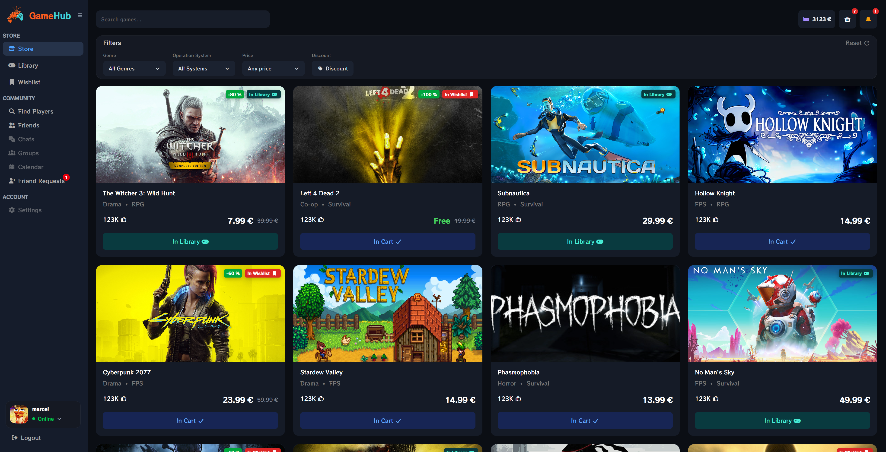
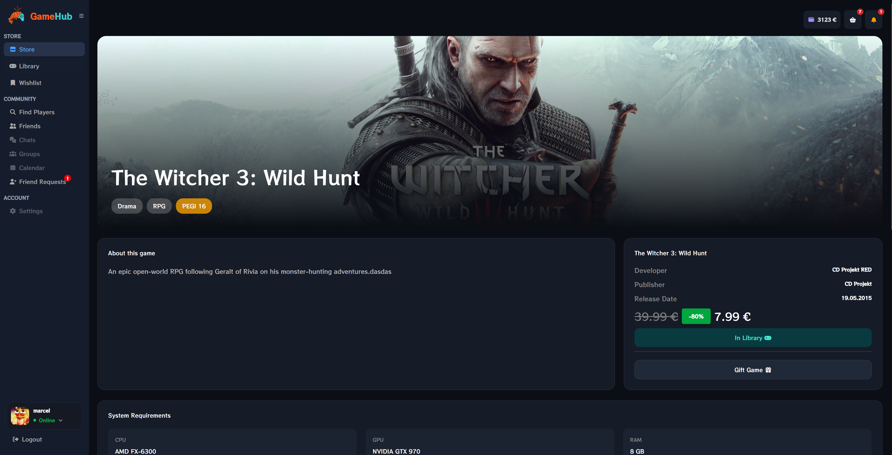
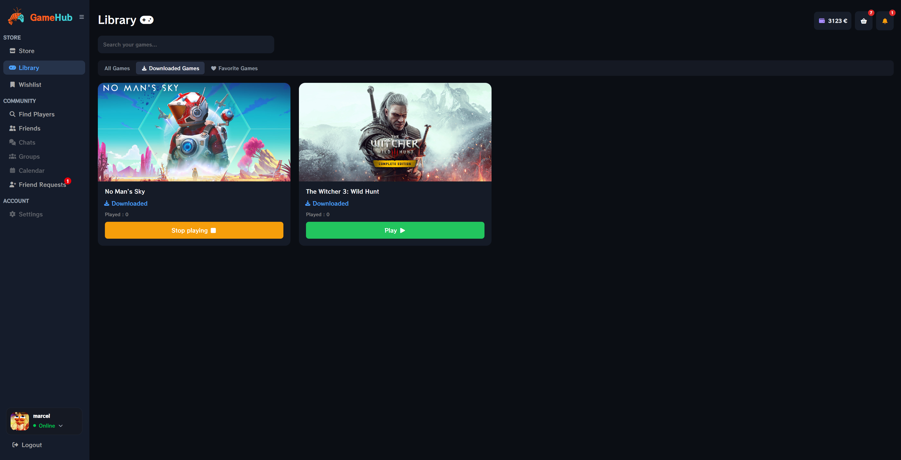
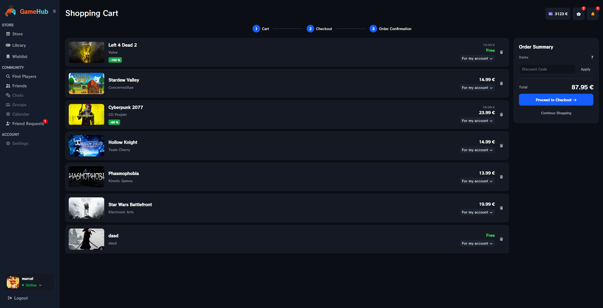
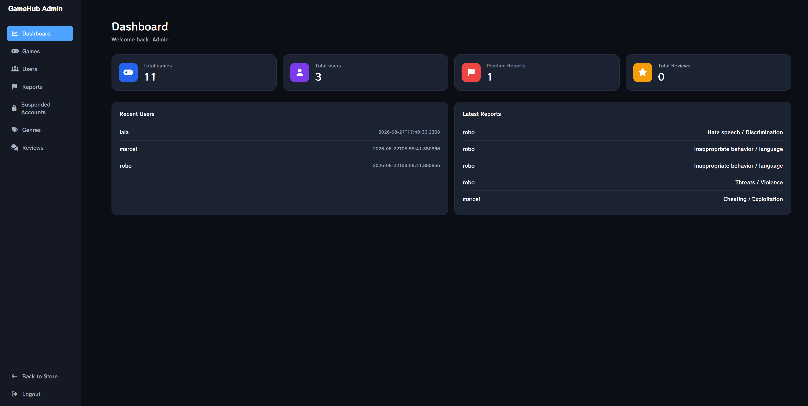
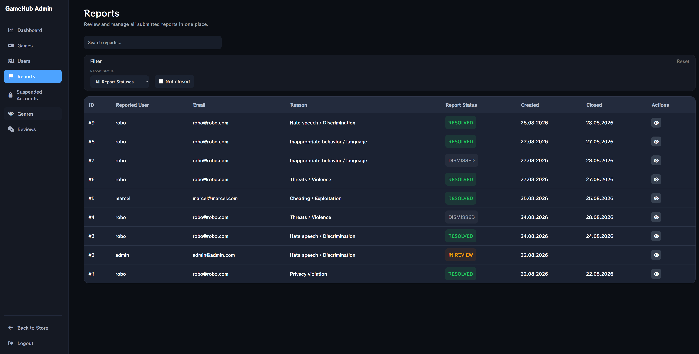

<p align="center">
  
</p>


GameHub is a full-stack gaming platform inspired by platforms such as Steam and Epic Games. The project explores the idea of building a gaming platform with its own features and approaches, including areas where existing platforms could be improved or handled differently.

A major focus of GameHub is its community experience. Players can create and join groups, organize Game Nights where other members can participate, and compete against other groups through group-versus-group events and tournaments. The goal is to make GameHub more than just a place to discover and manage games, but also a platform where players can actively connect, organize events, and play together.

Users can browse games, add them to their library or wishlist, customize their profiles, and manage their accounts. The application also includes administration and moderation tools for managing users and platform content.

<p align="center">
  
</p>

---

## ✨ Features

### 👤 User Features

* User registration and authentication
* Browse and search for games
* Detailed game pages
* "Purchase" games and add them to a personal library
* Wishlist management
* Profile customization, including banners, profile pictures, and card colors
* Password reset functionality
* Email notifications upon registration, account bans, and suspensions
* And much more

### 🛠️ Administration & Moderation

* Administrative dashboard
* User management
* Report management
* User moderation tools
* Account bans and suspensions
* Moderation history and account status tracking

---

## 📸 GameHub in Action

### 🎮 Game details in Store

<p align="center">

</p>

### 📚 Game Library

<p align="center">

</p>

### 🛒 Cart

<p align="center">

</p>

---

## 🛠️ Administration

### 📈 Admin Dashboard

<p align="center">

</p>

### 🚨 Reports

<p align="center">

</p>

---

## 🧩 Technical Features

* Persistent data storage using PostgreSQL
* REST API for communication between the frontend and backend
* Authentication and authorization
* Database migrations
* Email service integration
* Containerized development environment using Docker

---

## 🛠 Technologies Used

### Backend

* **Java 21**
* **Spring Boot**
* **Spring Data JPA**
* **PostgreSQL**
* **Maven**
* **Lombok**

### Frontend

* **Angular**
* **Tailwind CSS**

### Infrastructure

* **Docker**
* **Docker Compose**

---

## ▶️ Running the Application

### Prerequisites

Before running the application, make sure you have the following installed:

* Docker
* Docker Compose

### 🐳 Running with Docker Compose

1. Clone the repository and navigate to the Docker directory:

```bash
cd Game-Hub/game-Hub-be/docker
```

2. Start the application and its services:

```bash
docker-compose up
```

Once the containers are running, the application will be available at:

* **Frontend:** `http://localhost:4200/login`
* **Backend API:** `http://localhost:8088`

---

## 👥 Demo Accounts

Demo accounts are automatically created for development and testing purposes.

| Role              | Email               | Password   |
| ----------------- |---------------------|------------|
| 👤 User           | `marcel@marcel.com` | `heslo123` |
| 🛠️ Administrator | `admin@admin.com`   | `admin`    |


---

## 🚀 Planned Features

* 💬 Chat between system
* 👥 User-created groups
* 📱 Improved mobile responsive design
* 🚫 Blocking users
* 🔔 In-app notifications
* 📧💸 New Email notifications for example when games go on sale, banned reported user
* And much more 🚀
